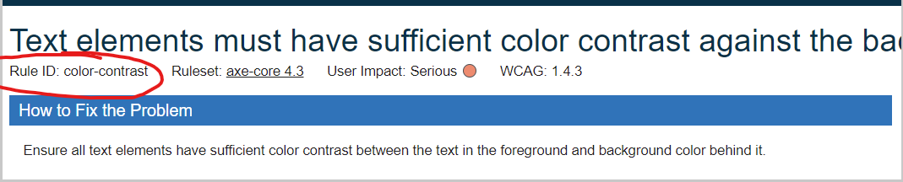

We use [cypress-axe](https://github.com/component-driven/cypress-axe) to test our isolated components.


## Selection:
To select a component, use the following selector (first the component name, then component status)

Example:
```js
cy.checkA11y('[data-component-name="addresses"][data-component-status="disabled"]', { })
```


## Runing tests
### Tags

We can test for a specific web standard (wcag 2.1 aa | aaa) by indicated it as part of the `runOnly` propriety without any other values (all sets of tags can be found [here](https://www.deque.com/axe/core-documentation/api-documentation/#axe-core-tags)

#### Example:
```js
cy.checkA11y('[data-component-name="addresses"]', {
      runOnly: {
        type: 'tag',
        values: ['wcag21aa']
      }
    })
```

This will scan all `addresses` components with the different states and check it against the `wcag21aa` standard.


## Tags and rules:
A list of rules can be found here: https://dequeuniversity.com/rules/axe/4.3

You can get the name from a specific rule by id (attachment) and add it to the Rules configuration if we want to test for a specific rule.



#### Example:
```js
cy.checkA11y('[data-component-name="addresses"][data-component-status="disabled"]', {
      runOnly: {
        type: 'tag',
        values: ['wcag21aa', 'cat.forms']
      },
      rules: {
        'color-contrast': {enabled: true},
      }
    })
```