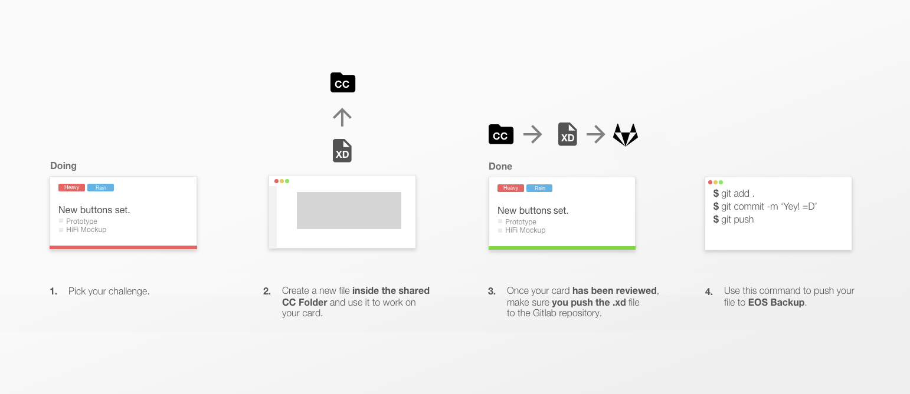

1. [Process](#process)
2. [How does the versioning system work?](#how-does-the-versioning-system-work)
3. [Naming Conventions](#naming-conventions)

## Process


1. Pick your challenge.

2. Create a new file inside the [shared CC Folder](https://adobe.ly/2KP6k9Y) by going to  your local folder "Creative Cloud Files", as shown here:


 and use this file to work your card.   

3. Once your card passes revision and the design moves to development make sure you push the .xd file to Gitlab https://gitlab.com/SUSE-UIUX/eos-backup.

4. Upload the file to the [EOS Backup](https://gitlab.com/SUSE-UIUX/eos-backup) repository by using the following commands:

```
git add .
git commit -m 'Message detailing the change' 
git push
```

Please note that the shared CC folder and the EOS Backup repository **need to be carbon copies of each other**.

[Click here to subscribe to the shared folder](https://adobe.ly/2KP6k9Y)

## How does the versioning system work?
All file versioning and backup will be done via git.

### Working Space
The main repository for our Adobe files is in Gitlab: 
https://gitlab.com/SUSE-UIUX/eos-backup

All work (completed and WIP) will be pushed to this git repository. 


## Naming Conventions
Naming conventions help provide a consistent way to find the content at a glance. Consistency within the project is vital. Follow the rules below for naming Adobe files as well as the assets produced from them.

* Do not use capital letters.
* Do avoid "special" characters (: / \ ¢ ™ $ ® [ ] { } ( ) ! ; " ' * ? < > |) and never use spaces, tabs, new lines and embedded returns.
* Do use consistent names for all assets named after what they represent.
* Do match the assets file name to the naming in the source file (group name or layer name, etc.) Being consistent is important in order to improve clarity when looking for a specific item in a psd file.
* Do name all source files after the conceptual piece(s)/component they contain. Examples are "header", "footer", etc.
* Do name files using hierarchy within components. Periods will be used for separating component hierarchy. For example  "main_component.more_specific_component_name".
* Do separate words within one conceptual piece/component. Underscores will be used for separators between words which describe a conceptual piece/component itself. Examples are "header.user_login.psd",  "main_navigation.dropdown_menu.psd", or "main_navigation.accordion.psd".
* Do use a dash "-" to reflect state. Examples are "button-hover" or "checkbox-on".
* Do add the postfix "WIP" to a filename to save work which is unfinished. Only one "WIP" file should be created for a given name.


