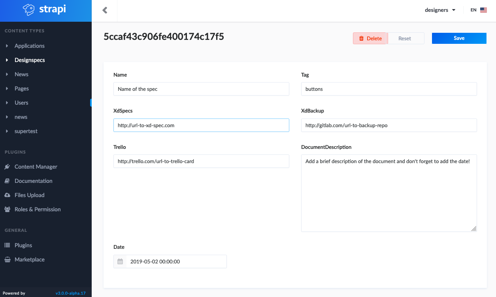
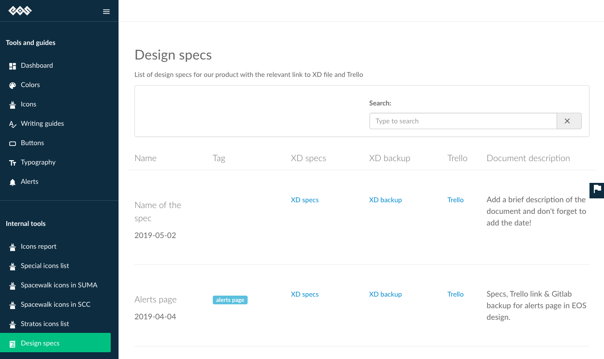

<!-- blank line -->
<figure class="video_container">
  <iframe src="https://drive.google.com/file/d/0B6m34D8cFdpMZndKTlBRU0tmczg/preview" frameborder="0" allowfullscreen="true"> </iframe>
</figure>
<!-- blank line -->

1. Access Strapi: ​https://eos-strapi-dev.herokuapp.com

2. Use the credentials provided

3. Once you're in the content manager panel, access the design specs section: https://eos-strapi.herokuapp.com/admin/plugins/content-manager/designspecs?_limit=20&_page=1&_sort=_id&source=content-manager

4. You'll need to fill the different fields and click the "Save" button

That's it! your design spec will appear in the specs section: https://eos-dev.herokuapp.com/internal/design-specs

