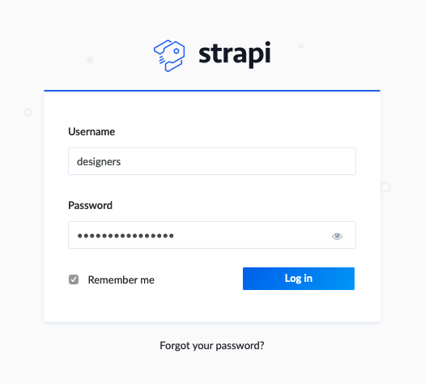
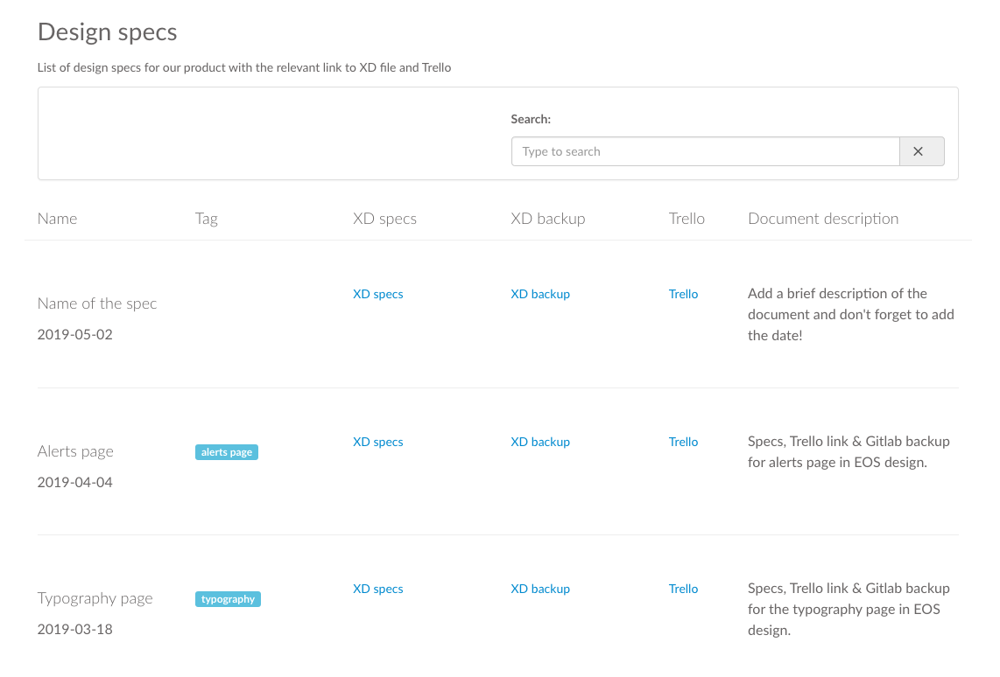

1. Access Strapi: https://eos-strapi.herokuapp.com/admin!

2. Use the credentials provided

3. Once you're in the content manager panel, access the design specs section: https://eos-strapi.herokuapp.com/admin/plugins/content-manager/designspecs?_limit=20&_page=1&_sort=_id&source=content-manager

4. You'll need to fill the different fields and click the "Save" button

<!-- blank line -->
<figure class="video_container">
  <video controls="true" allowfullscreen="true" poster="uploads/a1ccfdfefccf1af0327777105220c8d5/Screenshot_2019-05-02_15.12.01.png">
    <source src="uploads/ad28ad6bd42b8f58f45e7012e70951cf/May-02-2019_15-54-43.mp4" type="video/mp4">
  </video>
</figure>
<!-- blank line -->

That's it! your design spec will appear in the specs section: https://eos-dev.herokuapp.com/internal/design-specs

