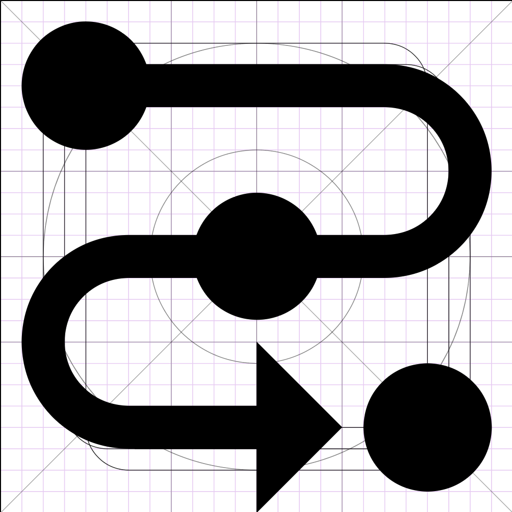
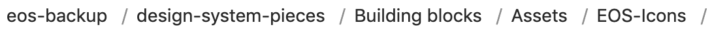
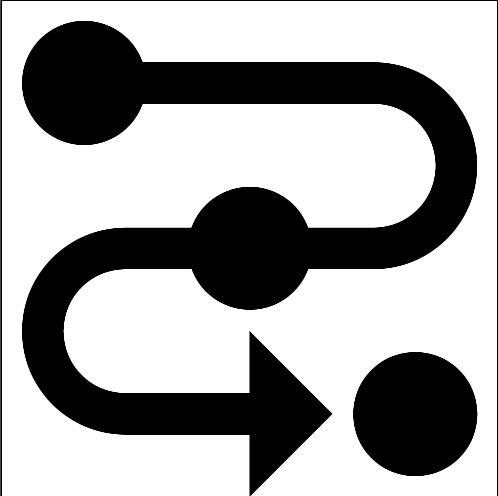

◀️ [Back](https://gitlab.com/SUSE-UIUX/eos/wikis/home#designing-the-eos-project)

# Designing new icons and compiling the EOS-icons font

## The repositories:

We use 2 different repositories when creating new icons:

1. EOS-backup repo: it holds the original designs in .ai (illustrator extension). The folder where icons in .ai are being saved is: `design-system/EOS-Icons/`. The repository's URL is https://github.com/SUSE/eos-backup. **NOTE**: AI files include a grid layer that must be used to comply with the [general design guidelines](https://gitlab.com/SUSE-UIUX/eos/-/wikis/Icon-Design-Guide).

2. EOS-icons repo: it holds the final .svg icons as well as the compiled version of the icon font (with a nice demo page `dist/index.html`). Repo URL: https://gitlab.com/SUSE-UIUX/eos-icons. **NOTE**: SVG files must not include the grid layer from the `.ai` files.

## Naming conventions for icons files:

The library used to compile the icon font requires some strict naming conventions:

- No `eos` prefix in the file name. The library will add a `.eos-icons` class for the usage of the icon in html. This class may be overridden by the developers using our iconic font, but this way it is compliant to Material Design Icons.

- No ` ` (spaces) or `-` (minus) to separate a more_than_one_word icon name. Use `_` (underscore) to separete them.

- No UPPERCASE_NAME.svg or Capitals_Either.svg. Use only lowercase_icon_names.svg

- Keep the file name as simple as possible, and as descriptive as possible. If the icon is a cloud, then call it cloud.svg

- When choosing a file name for the icon, always check that this icon name doesnt exist already in Material Icons: https://material.io/icons/. If it does, then it can be confusing when using EOS-icons together to Material Icons.

## Compiling the icon font:

All you have to do is:

1. Be at the project directory in your terminal `EOS-icons`
2. Run `grunt` to compile the fonts (follow the instructions in the readme.md file if this is the first time you run the compiler since you will need to configure some external plugins first: https://gitlab.com/SUSE-UIUX/eos-icons/blob/master/README.md)
3. Check the dist/index.html to see the demo page. Here you can test if your icon was compiled correctly.

## Creating a PR:

Step by step:

  - Be inside the **master** branch and pull for the latest changes
  - Create a new branch from **master**. Make sure the name of the branch is descriptive enough. For example, if your branch will add a new icon, use a name such as `new/virtual-reality-icon`, in the contrary, if your branch fixes an icon then use `fix/virtual-reality-inconsistent-design`
  - Use any icon from the eos-backup repository as your base so you get the grid layer to work with, or get the grid directly from https://adobe.ly/35u2psC. The icon size should be 24px by 24px. For example, this is how an icon in eos-backup looks like:

  - Once you have finished your icon, make a PR against eos-backup with the original **SVG or AI** file which includes the grid (just like the icon shown above). The directory where you should save the icon is:
https://gitlab.com/SUSE-UIUX/eos-backup/tree/master/design-system-pieces/Building%20blocks/Assets/EOS-Icons
.
  - Add the .svg icon without the grid into the `svg/` folder in the eos-icons repo. (https://gitlab.com/SUSE-UIUX/eos-icons/tree/master/svg), for example:

  - Inside the eos-icons repo, compile the icon font by running in the command line `grunt`.
  - Test that `dist/index.html` works well and you can see your icon there.
  - Create the commit by adding all the changes in `dist/` and your new icon in `svg/`. **IMPORTANT**: Your commit message needs to start with either `New:` or `Fix:`. Read more about our semantic release rules here: https://gitlab.com/SUSE-UIUX/eos-icons/-/wikis/semantic-releases
  - Push the changes and go to gitlab.com to create the Merge Request.
  - Someone from EOS will review your PR as soon as possible and let you know if there are changes to be done.

## Reviewing an icon PR:

First off, make sure that all the above has been followed. Secondarily:

1. Check that the SVG icon added to the `svg/` directory follows the guidelines present in: https://gitlab.com/SUSE-UIUX/eos/wikis/Icon-Review-Checklist
2. Check that the icon font compiled correctly by simply checking the `dist/index.html` file and that the new icon appears in there correctly. If it doesnt, it is most likely an issue with the file name or the SVG file itself.
3. Check that the new icon looks good in all the different sizes the `dist/index.html` demo page allows you to test. Other sizes are not required to be tested since those are the recommended sizes.