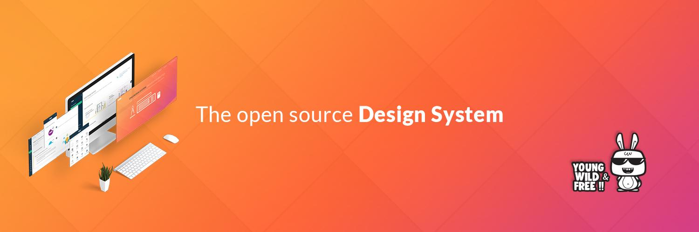

# About EOS Design System

Many companies of all different sizes struggle with today's IT agendas: bleeding edge software, agile development, short time-to-market, etc., and this "new" (and really not so) kid on the block is not making it any easier for developer and designers to keep up: UX design. 

Design Systems can help solve this problem, and a few more. Design Systems serve as a centralized source of information for UX, UI, and other brand-related guidelines that help not only developers find the UI element or component they need, but also designers to build faster prototypes while streamlining the collaboration between the two.

At EOS, we are creating the first open source and customizable Design System to help open source, SMEs, and all types of organizations deliver outstanding user interfaces, and consistent user experience cross-products by the hand of the current industry standards.

EOS also created an iconic font made specifically to fit more complex scenarios seen in more technical OSS, as for example endpoints_disconnected, file_system, repositories, proxy, and some other icons not found in the most popular and open source iconic fonts out there.

Our project relies upon several open source technologies:
Python, Node.js, Express.js, Fontforge, Strapi CMS, Bootstrap 4, Pug.js, and others.

# Contacting EOS Design System

Our main communication channel is Slack, although you will need to be invited first to join.
To be invited get in touch with us via any of the following:
- Slack: https://eos-community.slack.com. Request an invite at: https://slack.eosdesignsystem.com/
- Twitter: https://twitter.com/eosdesignsystem
- Gitlab: https://gitlab.com/SUSE-UIUX/eos

# Getting Started

This year, we want GSoC participants to work on EOS-icons. Help us make the most amazing, free and customizable icon set on the internet for open source products working on enterprise software for cloud computing, IoT, infrastructure, operating systems, augmented reality, etc.

Setting up EOS-icons locally is pretty easy. Our readme.md file in our repository explains everything you should do to have the instance running in your machine. It is important that you follow the instructions correctly:

https://gitlab.com/SUSE-UIUX/eos-icons-landing

As you have seen above, we use Gitlab as source control, which is a web runner of GIT (read more about GIT https://git-scm.com/). If GIT is new to you, we recommend you spending 20 minutes in this beginner's course https://www.codecademy.com/learn/learn-git.
We also recommend you using Fork if you use Mac or Windows: https://git-fork.com/. It is an excellent GUI (graphical user interface) to use GIT avoiding the terminal.

To submit a bug, you should simply go to our issues list in Gitlab (https://gitlab.com/SUSE-UIUX/eos-icons-landing/issues) and report in as many words as possible, using examples (images if you can, too), and everything you can so other contributors can understand exactly the issue and how to reproduce it or understand it. Ideally, open a PR to solve it yourself since, according to Python rules for GSoC, you should have submitted at least 1 Pull Request (or merge request as it is called in Gitlab) in order to become eligible for GSoC.

If you would like to submit a bug fix for an already submitted issue, please make sure that the issue has been assigned a label first. Issues with no labels assigned are not yet ready, they are either waiting for a response, have not been read, or are not aligned with the current roadmap. If you opened an issue and would like to start working immediately on it but no label has been assigned, please contact @cynthia in our slack channel and ask her to review your issue ASAP. She's our Product Owner and will try to respond as promptly as possible.

# Writing your GSoC application

The first and most important step to not get rejected is to remember to add the name of our sub-org (EOS) in the title of your GSoC application. Students not adding "EOS" will be rejected by Python.org. More information at http://python-gsoc.org/index.html#apply

Get in contact with the mentors of the project you chose ASAP. The time you wait to get in touch could be the difference between getting selected or going home.

Before even submitting the idea, get a feeling of EOS-icons: clone the repository and get a better understanding of what we're doing. Again, ask as many questions as you want!

Take some hours to read the full WIKI page of EOS: https://gitlab.com/SUSE-UIUX/eos/wikis/home. Yes, we have a lot of pages but they will help you get those Pull Requests merged faster if you understand our coding conventions beforehand.
*NOTE*: all the information in this wiki applies to EOS-icons. We have all of our guidelines in one repo since we apply the same rules and settings to all of our products at EOS in order to have a cohesive codebase across products.

### Application template

* Contact information *

> Name:
> E-mail address:
> Time zone: 
> Other information that may be useful to contact you.

* Synopsis *

> Give us the “elevator pitch“. You have 30 seconds to tell us what you are going to make, why we will like this project, and to convince us that you are qualified to do it! (You might want to write this section last).

* Which of the published tasks are you interested in? What do you plan to do? *

> Detail your idea. Take into consideration the current technologies used at EOS and explain how they can be used, perhaps introducing new ones, to successfully achieve the task.

* What have you done so far with this idea? *

> Research, benchmark with other tools available in the market, analyze the best options, try out EOS, and possibly even make a PR or 2 to warm up with the team.

* Schedule of Deliverables *

> Make a plan. Being disciplined is important and it will help you have a stress-free summer coding amazing features. We won't micromanage you if you haven't stuck to the plan by the hour, it is not the point. We want you to be organized and in sync with the EOS team.

* Tell us about your previous experience * 

> Take the time to tell us about previous work experiences, courses you've taken, open source projects you've contributed to.

* Tell us a bit about you *

> We also want to have a sense of who you are as an individual. At EOS we are young and very energetic. We have artists, musicians, gamers, and all types of people ready to have some quality time on Slack too.

# Project Ideas

## Project 1

**Project Title:** Icons and EOS web page

**Skill Level:** Easy

**Description:** EOS delivers a set of icons that are made 1-to-1 following Material Design Icons. They are currently published at https://suse-uiux.gitlab.io/eos-icons/. The problem with this page is that it lacks engagement and information about the project: how to contribute new icons, how to submit icons request, how to install it, etc. On the other hand, EOS has a landing page that is more engaging, but there is a lot of useful information missing too. The EOS landing page could benefit from a section with a more automated way to scale the sub-pages and content with a CMS.

**Deliverable:** The main objective of this project is to deliver a web interface for EOS icons and EOS Design System, where both are aligned in terms of UX/UI and ideally can be managed with a headless CMS, such as Strapi [this is the currently used and preferred CMS at EOS].

**Mentors:** Cynthia Sanchez, Jesus Herman, Sorin Curescu, Manuele Carlini.

**Skills:** SCSS, Bootstrap 4, Heroku, Adobe XD, Headless CMSs.

**Get started:** You will need to learn more about Strapi first (https://strapi.io), implement it in a free Heroku node so you can use it in your front-end. Consider learning about JAMstack (https://jamstack.org/) as this may be a perfect use case for it. Once you have all the technical preparation, you should research and find the best ideas for the UI of the pages (https://www.streamlineicons.com/ is a nice benchmark). Our team will certainly help you with illustrations and others if you need, but the general layout and idea have to come from you. It is recommended that we use the Design System as a baseline for the UI pieces.

## Project 2

**Project Title:** Web UI builder

**Skill Level:** Intermediate

**Description:** EOS Design System is an open source set of guidelines, components, elements, and more. All these tools are there to help developers and designers create products in a consistent and efficient way. The goal of a Design System is that all products in a portfolio look and feel the same in order to enhance the user experience and brand perception. While a good documentation of all these components help designers and developers understand how and when to use them, nothing could make their life easier than enabling developers and designers to create quick mockups in an online web UI builder that use the exact color, size, and shape of the UI block defined in the design system.

There is already an open source web builder available: https://github.com/artf/grapesjs. You can check out the demo at: https://grapesjs.com/demo.html. And several other proprietary builders:
https://www.layoutit.com/build, https://pingendo.com/
Use the examples above to get the best ideas for the UI builder, keeping in mind that we expect a more minimal result given the size of a project like that, so you will need to plan this accordingly. We will help you.

EOS follows the Atomic Design process for building UI blocks:

If you want to understand more about Atomic Design, we recommend you read the following article: https://medium.muz.li/building-design-systems-with-atomic-design-93a13286f676

**Deliverable:** The main objective of this project is to deliver a basic web UI builder that can easily register new UI elements, and that can export mockups (perhaps just a PDF or screenshot at first).

**Mentors:** Cynthia Sanchez, Jesus Herman, Sorin Curescu, Manuele Carlini.

**Skills:** Node.js, Express.js, CI, Angular/React/Backbone, Pug.js, SCSS, Bootstrap 4, Heroku.

**Get started:** Research and test the waters first. Grapesjs may not be the only open source available solution. Start small and keep a close communication gap with your mentors, we are entirely available for you. Your success is our main priority.

## Project 3

**Project Title:** Icons picker and custom font generator

**Skill Level:** Easy

**Description:** EOS delivers a set of icons that are made 1-to-1 following Material Design Icons. They are currently published at https://suse-uiux.gitlab.io/eos-icons/ for you to see them. These icons are also available in an extended version which includes both fonts (EOS and Material Design) in one. Some users will use the extended version, some other will use only the EOS icons, however, in both scenarios it would be unusual that a project uses all of the icons available in a font. Including a library of 90% unused icons in a web project reduces performance unnecessarily. 

**Deliverable:** Having an icon picker to chose the icons needed from the 2 available icon fonts. Once the icons are selected, the application should enable the user to generate and download the custom font. A nice to have for this project would be to enable recurrent users to continue building their previous selections.

**Mentors:** Cynthia Sanchez, Jesus Herman, Sorin Curescu, Manuele Carlini.

**Skills:** JS, Grunt, Adobe XD, Gitlab CI, some HTML and SCSS.

**Get started:** We use Fontforge with Grunt to automatically generate the EOS icon font with a simple CLI script. Take the time to understand the bases of how the font is generated, how Fontforge is configured and the extent of what this last one can does. You will need to work on a UI to pick the icons. We expect to see some mockups creations and the implementation of them. You need to get some understanding of how Gitlab CI works, for this you should read more about YAML (https://yaml.org) and the concepts of CI/CD (https://about.gitlab.com/product/continuous-integration/). This is important because the webpage is currently served by Gitlab pages and generated in CI. 

# Useful links:

- Basic instructions to setup and use GIT in open source:

https://gitlab.com/SUSE-UIUX/eos/wikis/GSoC-basic-git-instructions

- Javascript conventions we follow at EOS:

https://gitlab.com/SUSE-UIUX/eos/wikis/Writing-standard-JS-code

https://standardjs.com/rules.html

https://gitlab.com/SUSE-UIUX/eos/wikis/code-commenting-standards

- CSS conventions:

https://gitlab.com/SUSE-UIUX/eos/wikis/Editing-css-style-guide

https://gitlab.com/SUSE-UIUX/eos/wikis/CSS-structure

https://gitlab.com/SUSE-UIUX/eos/wikis/code-commenting-standards

- How to name your branches:

https://gitlab.com/SUSE-UIUX/eos/wikis/naming-conventions-for-new-branches