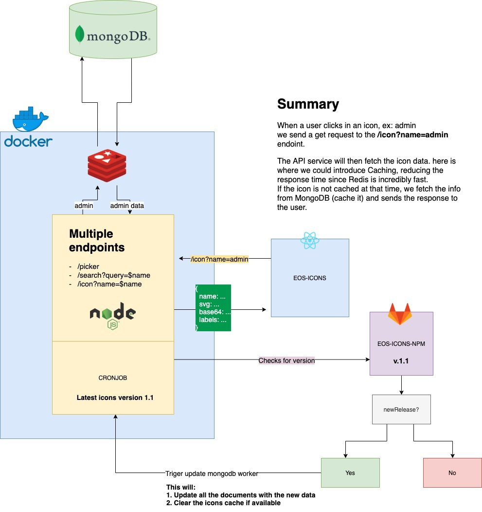

# About EOS UI/UX Solutions

EOS UI/UX Solutions is an open-source organization that aims to help improve user experience with a set of solutions like the EOS Design system, EOS icons, user Story, and more to come. 

**OUR MISSION**

To empower creativity by making UX and UI easily accessible to designers and developers.
Our mission is to help deliver quality interfaces while accelerating time-to-market.

**OUR VISION**

To reshape the enterprise and open source worlds with applications people love to use.

Take a look at our new brand website: https://brand.eosdesignsystem.com/

**OUR TECHNOLOGY**

Our projects rely upon several open source technologies:
Python, Node.js, Express.js, Fontforge, Strapi CMS, Bootstrap 4, Pug.js, and others.

# Contacting EOS Design System

Our main communication channel is Slack, although you will need to be invited first to join.
To be invited get in touch with us via any of the following:
- Slack: https://eos-community.slack.com. Request an invite at: https://slack.eosdesignsystem.com/
- Twitter: https://twitter.com/eosdesignsystem
- Gitlab: https://gitlab.com/SUSE-UIUX/eos

# Getting Started

For this 2021 GSoC we have compiled a series of "small" projects in relation to 2 of our best projects from EOS:

https://eos-icons.com/ (Repository: https://gitlab.com/SUSE-UIUX/eos-icons-landing)
https://userstory.eosdesignsystem.com/ (Repository: https://gitlab.com/SUSE-UIUX/eos-user-story)

Setting them up locally is pretty easy. Our readme.md file in each repository explains everything you should do to have the instance running in your machine. It is important that you follow the instructions correctly. If you run through any problem you can ping us in the #development channel, but bear in mind that the mentors are also very busy, so your first resource should be to read the instructions carefully. 

If you find that an important step was not mentioned in any of the readme.md files, feel free to open a PR adding the information.

As you have seen above, we use Gitlab as source control, which is a web runner of GIT (read more about GIT https://git-scm.com/). If GIT is new to you, we recommend you spending 20 minutes in this beginner's course https://www.codecademy.com/learn/learn-git.
We also recommend you using Fork if you use Mac or Windows: https://git-fork.com/. It is an excellent GUI (graphical user interface) to use GIT to avoid the terminal.

To submit a bug, you should simply go to our issues list in Gitlab (https://gitlab.com/SUSE-UIUX/eos-icons-landing/-/issues or https://gitlab.com/SUSE-UIUX/eos-user-story/-/issues ) and report in as many words as possible, using examples (images if you can, too), and everything you can so other contributors can understand exactly the issue and how to reproduce it or understand it. Ideally, open a PR to solve it yourself since, according to Python rules for GSoC, you should have submitted at least 1 Pull Request (or merge request as it is called in Gitlab) in order to become eligible for GSoC.

If you would like to submit a bug fix for an already submitted issue, please make sure that the issue has been assigned a label first. Issues with no labels assigned are not yet ready, they are either waiting for a response, have not been read, or are not aligned with the current roadmap. If you opened an issue and would like to start working immediately on it but no label has been assigned, please contact the mentors in our slack channel #gsoc-2021 and ask them to review your issue ASAP. 

# Writing your GSoC application

The first and most important step to not get rejected is to remember to add the name of our sub-org (EOS) in the title of your GSoC application. Students not adding "EOS" will be rejected by Python.org. More information at http://python-gsoc.org/index.html#apply

Get in contact with the mentors of the project you chose ASAP. The time you wait to get in touch could be the difference between getting selected or going home.

Before even submitting the idea, get a feeling of EOS-icons and User Story: clone the repositories and get a better understanding of what we're doing. Again, ask as many questions as you want!

Take some hours to read the full WIKI page of EOS: https://gitlab.com/SUSE-UIUX/eos/wikis/home. Yes, we have a lot of pages but they will help you get those Pull Requests merged faster if you understand our coding conventions beforehand.
*NOTE*: all the information in this wiki applies to all of our projects. We have all of our guidelines in one repo since we apply the same rules and settings to all of our products at EOS in order to have a cohesive codebase across products.

### Application template

* Contact information *

> Name:
> E-mail address:
> Time zone: 
> Other information that may be useful to contact you.

* Synopsis *

> Give us the “elevator pitch“. You have 30 seconds to tell us what you are going to make, why we will like this project, and to convince us that you are qualified to do it! (You might want to write this section last).

* Which of the published tasks are you interested in? What do you plan to do? *

> Detail your idea. Take into consideration the current technologies used at EOS and explain how they can be used, perhaps introducing new ones, to successfully achieve the task.

* What have you done so far with this idea? *

> Research, benchmark with other tools available in the market, analyze the best options, try out EOS, and make a PR or 2 to warm up with the team. PSF guidelines are very strict and state that only those who have submitted a PR to the project in the matter will be eligible for GSoC.

* Schedule of Deliverables *

> Make a plan. Being disciplined is important and it will help you have a stress-free summer coding amazing features. We won't micromanage you if you haven't stuck to the plan by the hour, it is not the point. We want you to be organized and in sync with the EOS team.

* Tell us about your previous experience * 

> Take the time to tell us about previous work experiences, courses you've taken, open source projects you've contributed to.

* Tell us a bit about you *

> We also want to have a sense of who you are as an individual. At EOS we are young and very energetic. We have artists, musicians, gamers, and all types of people ready to have some quality time on Slack too.

# Project Ideas

## Project 1

**Project Title:** EOS icons react library

**Skill Level:** Easy

**Description:** EOS delivers a set of icons that are made 1-to-1 following Material Design Icons: eos-icons.com. 

**Goals:** We want to deliver EOS-icons as an independent React library so that a React project can simply install the npm package and use icons as components such as `<eos-icons name='home'>` (just an example).

**Deliverable:** A new NPM package is registered in the npm registry (your mentors will take care of the initial registration) and have it configured to be fully automated like https://gitlab.com/SUSE-UIUX/eos-icons, which releases a new npm package every time semantic-release detects a new version.

**Mentors:** [Cynthia Sanchez](https://twitter.com/cyntss), [Sorin Curescu](https://twitter.com/en3sis), [Kartikay Bhutani](https://twitter.com/kbhutani0001), [Aditya Sharma](https://twitter.com/sharmaadi570191), [Shashank Jarial](https://twitter.com/ShashankJarial), [Devesh Vijaywargiya]()

**Skills:** React, CI, semantic-release, YAML.

**Get started:** Play around with eos-icons by forking it first and understanding how CI works with semantic release. It is very important that you read the Wiki since a lot of information is found there.

## Project 2

**Project Title:** EOS-icons - Improvements

**Skill Level:** Easy

**Summary:** EOS-icons.com is an amazing website and we have loads of ideas in mind to make it even better. And the best, we want you to bring more ideas too!

**Features we're thinking about:** copy SVG code, copy base64 code, UI to suggest labels on icons, use local storage to remember last selected icons, Improve the search engine for icons adding predictive search, full-text distributed search, and other functionalities, show latest icons added (this depends on us adding the date of creation for icons in the models)

**Deliverable:** 
We simply expect that you will work on the features that we mentioned above, or that you will propose your own improvements after having taken a deep dive into eos-icons.com. We want eos-icons.com to offer the best experience in the market, and all the tools to enable developers to get the icons fast and in the format they need.

**Mentors:** [Cynthia Sanchez](https://twitter.com/cyntss), [Sorin Curescu](https://twitter.com/en3sis), [Kartikay Bhutani](https://twitter.com/kbhutani0001), [Aditya Sharma](https://twitter.com/sharmaadi570191), [Shashank Jarial](https://twitter.com/ShashankJarial), [Devesh Vijaywargiya]()

**Skills:** SCSS, SVG SMIL, React.js.

**Get started:** Play around with eos-icons.com and check out the list of features we propose. If you have more and better ideas, don't be shy! We want to hear how you think eos-icons.com would be more productive for you, too.

## Project 3

**Project Title:** EOS-icons - extensions for third party applications

**Skill Level:** Medium

**Description:** EOS delivers a set of icons that are made 1-to-1 following Material Design Icons: eos-icons.com

**Goals:** There are several UI applications that are broadly used: Figma, Adobe XD, and also IDEs like Visual Studio Code, etc. These applications offer the possibility to create extensions/add-ons to implement icons from other icon libraries. We want to deliver EOS-icons extensions for these big players to enable designers and developers to easily implement icons without having to leave their application.

**Deliverable:** This project can be shared with another participant as we understand it may be somehow ambitious to deliver 3 extensions in a short time frame. The main applications we're focusing on are Figma, Adobe XD, and VSC. It is vital that you investigate all the APIs. Once the selection process ends, we will help you arrange the distribution of work with your partner for this project (if the quota allows it).

**Mentors:** [Cynthia Sanchez](https://twitter.com/cyntss), [Sorin Curescu](https://twitter.com/en3sis), [Kartikay Bhutani](https://twitter.com/kbhutani0001), [Aditya Sharma](https://twitter.com/sharmaadi570191), [Shashank Jarial](https://twitter.com/ShashankJarial), [Devesh Vijaywargiya]()

**Skills:** Python, React.js, SCSS, and others. It depends on the API.

**Get started:** Read more about the APIs to create extensions for Figma, Adobe XD, and VSC.

## Project 4

**Project Title:** User Story - Improvements and new features

**Skill Level:** Medium

**Description:** User Story is an interface to manage projects in the open. It allows everyone to see how new requests from users move across the roadmap and implementation process, but most importantly, it allows users to tell their story! to tell developers how they're using the application and request new features, report bugs, etc. At the same time, users can interact with one another, voting for features to show more interest so developers can prioritize features accordingly, adding comments, screenshots, etc.

**New features:** 

- Request templates. What? To have the ability to configure predefined templates for certain products, for example, for EOS-icons we would like to have a template for new icon requests. Why? it would help products provide guidelines for things that have a standard in place already. Our example is EOS icons, where we ask people to give us the name of the icon, images of icons they have seen online, and a brief description of how the icon will be used in the interface. For other communities/companies, the case could be similar: they can provide templates for regular requests.
- Generate a shareable link with 1 click to enable easy sharing of stories among users across various platforms
- Search stories via home page.
- Increase test coverage by writing more unit tests for edge cases.

**Mentors:** [Cynthia Sanchez](https://twitter.com/cyntss), [Sorin Curescu](https://twitter.com/en3sis), [Kartikay Bhutani](https://twitter.com/kbhutani0001), [Aditya Sharma](https://twitter.com/sharmaadi570191), [Shashank Jarial](https://twitter.com/ShashankJarial), [Devesh Vijaywargiya]()

**Skills:** Strapi, React.js, Node.js, SCSS, MongoDB, GraphQL

**Get started:** Install User Story with EOS-strapi locally to learn more about the project. It takes some time to understand how all the layers of the application work, so please don't underestimate this project. You will need to learn some about GraphQL, mondoBD (document oriented DB - nonSQL databases) to understand how our API works.

## Project 5

**Project Title:** EOS icons API

**Skill Level:** Medium

**Description:** Unify our micro-services in a single REST API that will take care of custom icon pack generator, icon information (tags, description, etc.) and potentially filtering/searching.

**Goal:** Right now the API is in charge of generating new icons sets, customizing SVGs and PNGs.
We want to extend the functionality by adding new features as for example generating SVG code-snippets, base64 encoded images, allow users to recommend a new tag for an icon, make use of sessions to follow up with your last customization, cache requests for better performance while serving custom versions of icons, etc...

One example (displayed on the Diagram) would be when an icon is clicked, we send a request to our API endpoint (ex: www.oursite.com/api/v1/icons?name=admin) and this will respond with the icons name, description, SVG string, Base64 encoded image and tags).   
We're also exploring on adding a more robust query to the single icon endpoint so users can grab the version of it via command line by passing parameters like for example: `...&type=png&color='#000'&size=58`.

Nice to have: translation middleware with Deepl (https://www.deepl.com/en/docs-api/) or other free translation services to enable i18n when users search for icons using languages other than English. Why a middleware? Our tags used as search keywords are all in English, so in order to continue using a singular language translating the request from X-language into English would be the best solution.

**Deliverable:** The main focus will be to store individual icons as documents in our MongoDB database, cache similar requests and provide new ways to consume the icons (SVG strings and base64) and if the times allows, have a solid deployment solution with Docker.

**Mentors:** [Cynthia Sanchez](https://twitter.com/cyntss), [Sorin Curescu](https://twitter.com/en3sis), [Kartikay Bhutani](https://twitter.com/kbhutani0001), [Aditya Sharma](https://twitter.com/sharmaadi570191), [Shashank Jarial](https://twitter.com/ShashankJarial), [Devesh Vijaywargiya]()

**Skills:** Node.js, MongoDB, Redis, Docker, Gitlab Hooks

**Get started:** 
- The current API can be found at https://gitlab.com/SUSE-UIUX/eos-icon-picker that will be used as the base for our new features and improvements. A good starting point would be creating REST API with Express.JS
- Having a look at https://redis.io/ is also recommended (mainly used together with Node.JS).
- Introduction to Docker and docker-compose.

# Useful links:

- Basic instructions to set up and use GIT in open source:

https://gitlab.com/SUSE-UIUX/eos/-/wikis/Basic-git-instructions-for-beginners

- Javascript conventions we follow at EOS:

https://gitlab.com/SUSE-UIUX/eos/wikis/Writing-standard-JS-code

https://standardjs.com/rules.html

https://gitlab.com/SUSE-UIUX/eos/wikis/code-commenting-standards

- CSS conventions:

https://gitlab.com/SUSE-UIUX/eos/-/wikis/Writing-standard-scss-code

https://gitlab.com/SUSE-UIUX/eos/-/wikis/SCSS-structure

- How to name your branches:

https://gitlab.com/SUSE-UIUX/eos/-/wikis/Naming-conventions-for-new-branches