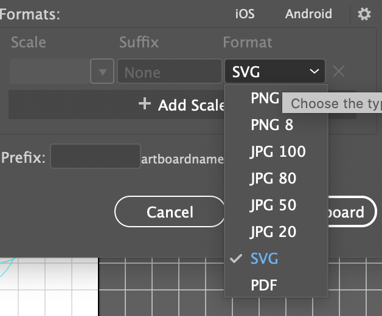
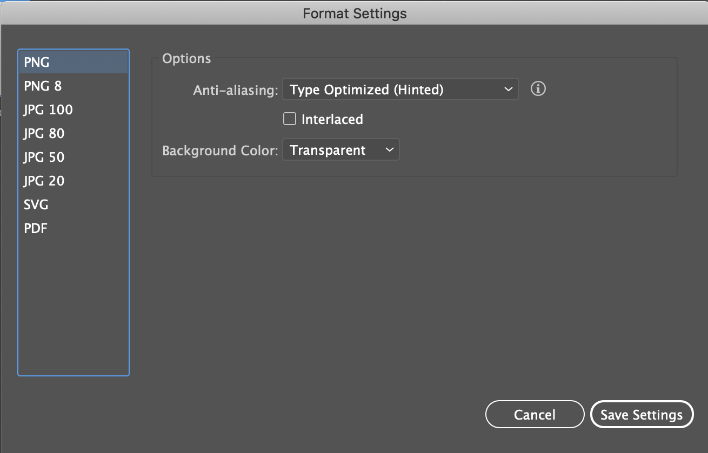
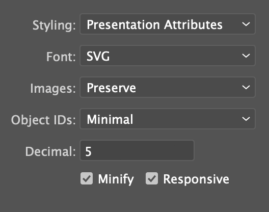

◀️ [Back](https://gitlab.com/SUSE-UIUX/eos/-/wikis/home)

# Use the template

Always start a new icon design by using the AI template available at:
https://gitlab.com/SUSE-UIUX/eos-backup/-/tree/master/eos-icons

`EOS-icons.ait`

It has the correct settings, guidelines, and grid system.

## Design

When creating icons it is important to first ensure that no icon already exists for this purpose. It is equally important to not re-use an existing icon for a different purpose.

All icons should follow Googles' [Guide for Creating System Icons](https://material.io/design/iconography/system-icons.html).

## File name

The .svg file name should not contain the name "eos" or "eos-" but the actual name of the icon, as the compiler will automatically add "eos-" to all icons, please follow the naming conventions: https://gitlab.com/SUSE-UIUX/eos/wikis/Adobe-design-file-versioning-and-naming

## Exporting SVG from Adobe Illustrator

- Make sure the color of the icon is black #000000. Any other color will add unwanted data and make the SVG incompatible for customization.

- Use the option "File/Export/Export for screens" and select SVG user Format:

- Right next to "Android" there is an icon for format settings . Click on it to see the following screen:

- Select SVG and make sure you have the exact configuration as shown below:

Any change in that configuration will introduce CSS, IDs, and other unwanted data inside the SVG file. Having CSS or inline attributes makes the SVG incompatible for customization.

### Next steps

2. [File conventions for creating new icons](https://gitlab.com/SUSE-UIUX/eos/-/wikis/File-conventions-for-creating-new-icons)
2. [Icon review checklist](https://gitlab.com/SUSE-UIUX/eos/wikis/Icon-Review-Checklist)
