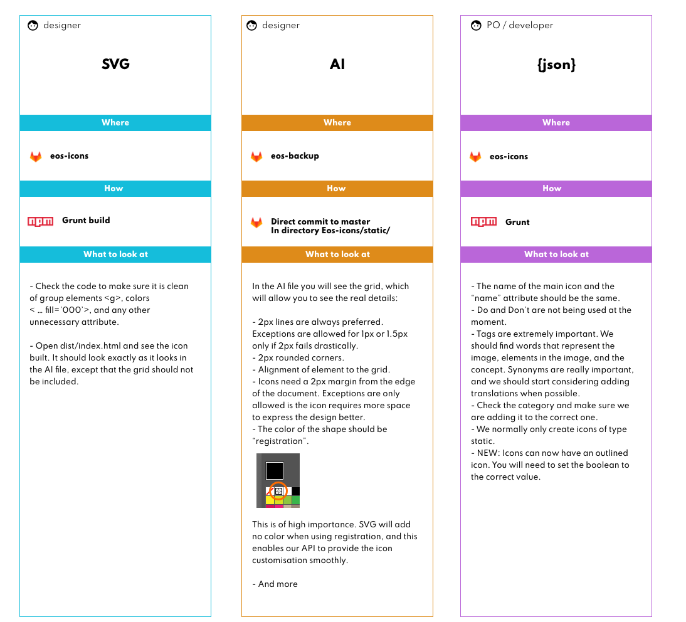

◀️ [Back](https://gitlab.com/SUSE-UIUX/eos/wikis/home#designing-the-eos-project)

## Review process and agents involved in the 2 tier review:

Link to the presentation: https://xd.adobe.com/view/69e5870b-7565-4acc-9bfe-8e33eac1d23c-3cb6/?fullscreen

##### 2 tier review process explained

1. An Icon card will always have `[XD]` in the Trello card by default. This label on the card title indicates that the design process is ongoing.
2. The designer will move the card to "In review" once the design is created and after any suggestions or ideas have been clarified to provide 1 result. They will not open a PR, 
but only push a new branch to the eos-icons repository and leave a comment on the Trello card mentioning the name of the branch. The designer will only run the command `grunt build` to test the icon compiles correctly locally.
3. Having the `[XD]` on the title, and once the card is moved to "In review", Meggie will assign a reviewer for the design part from the **XD-review** pool.
4. The Design review will include reviewing the AI file and making sure that the icon is not a duplicate from what we already have in http://eos-icons.com/, as well as the 2 elements described in the first and second columns of the graphic above (blue and orange). If you are reviewing outlined icons, please remember to review the compiled icon from **eos-icons/dist/outlined/index.html**.
5. Once the design is approved, the reviewer of this card will proceed with generating the model and compiling the font. The reviewer will also take care of removing the `[XD]` label from the card.
6. We are now in the developer tier, therefore once the PR is opened, only a developer will be assigned to review this next step, from the **code-reviews** pool.
7. At this point the purple column defines the important elements to consider in the review, but we should always double-check that dist/index.html runs correctly, as well as the name of the commit messages that should be aligned with the requirement on the card.

##### Good pages to find synonyms

The Saurus: https://www.thesaurus.com/browse/synonym

Also, typing "synonym *****" on Google, where **** would be the world, normally brings some good results when "Thesaurus" doesn't have good alternatives.

*Important*: Make sure the synonym matches the meaning of the word. Sometimes it may happen that a word has 2 or more meanings. In cases as such, you need to pay attention to the synonyms and make sure the meaning is related.

## Extended guide to review an icon

Source: https://material.io/design/iconography/system-icons.html

It is important that each icon pull-request is reviewed properly before merging. The checklist below can help you ensure that a given pull-request is ready to be merged.

Some icons might exhibit differences in line-thickness and padding(?). Every such case should be discussed with the submitter to determine whether an exception to the rule is warranted (#15). Exceptions are allowed but should stay in the minority or they are no longer exceptions but rather should become the rule.

1. Clone or download the pull-request branch in order to view the file locally. Do not view the icon in the browser!

1. Check that the name of the icon follows the [icon naming rules](https://gitlab.com/SUSE-UIUX/eos/wikis/Designing-and-compiling-svg-icons#naming-conventions-for-icons-files).

1. Check that the .ai source file is properly saved in the [correct repository] (https://gitlab.com/SUSE-UIUX/eos-backup). Open the .ai file to ensure that it is identical to the SVG file from the pull-request, except the ai. file has the grid in it.

1. Check if the icon fits the description of its purpose in the associated Trello card.

1. Check whether there are any existing material or Eos icons which use a similar visual metaphor.

1. Check that the icon is front-facing and fits with the other material and Eos icons.

1. Check whether icon forms and lines can be simplified. Ensure that negative space is optimally used.

1. Check that the canvas is 24p high and 24px wide and that there are 2 empty pixels on all sides of the icon.

1. Check that lines and shapes are aligned to the grid and, where applicable, the keyline shapes (the squares, rectangles, and circles visible in the grid).

1. Check that all or most-all lines are 2px in thickness. If any line is less than 2px thick it should only use geometric forms that other icons are based upon.

1. Check that all outer corners have a 2px radius. 

1. Check that line-ends are not rounded.

1. Check that none of the interior corners are rounded.

1. Check that the grid is not visible.

1. Discuss any exceptions to the rules above with the submitter in the pull-request itself.

1. Open index.html in the /dist folder to ensure that the font has been compiled correctly and that all icons are shown.

## Outlined version
### For Designers:
While building the outline version of an icon we need to:
1. Place the outlined SVG version (keep the same name as the normal version, you *don't* have to add any other name to it) under the `/svg-outlined` folder.
2. Run `grunt build`. This will create a new folder under `dist/outlined` that contains the new font and the preview (opening the `dist/outlined/index.html` you can see the results)

### For developers
To make sure everything works as expected, we need to run `grunt`. It will:   
1. Check to see if an outlined icon has the normal version. If not, a warning will be shown.
2. Once a new outlined version is detected, it will search for the model of the icon under `models` folder and add a new boolean propriety called `isOutlined`. This will help us to understand which icons have an outlined version. 
3. To generate the `eos-icons-outlined` version, it will copy all the files (minus the icons that already have an outlined version) from the normal folder (`./svg`) to a temporal folder called `temp` that will be used for the build process. The same script will remove the folder once the build is completed.
4. You can now test the build by visiting `dist/outlined/index.html`

*NOTE*: Since MD Icons already have all the outlined versions, our script will add the `isOutlined` to all MD models.

