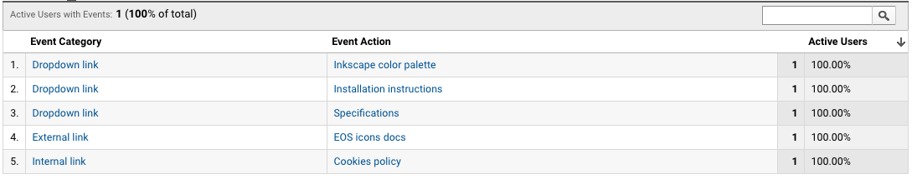
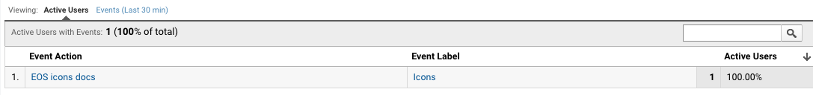

### What is it?

In order to track links, we use event tracking. Google Tag Manager (GTM) takes care of firing the Google Analytics (GA) script when a click event happens. Then, the information for that link is sent. 

There are many ways GTM can gather information from a link, but in our case, we're using the HTML 5 `data-` attribute tag. This allows us to send information to GA that is relevant to us. 

### How does event tracking work in EOS?

Google Analytics events are usually structured in the following way:
* **Event category:** Typically the object that was interacted with (e.g. 'Video')
* **Event action:** The type of interaction (e.g. 'play')
* **Event label:** Useful for categorizing events (e.g. 'Fall Campaign')

Since our current focus is tracking links, we've set up our data attributes the following way:
* **Event category:** This is where we define the type of link: 'Dropdown link', 'External link', 'Internal link'
* **Event action:** Here we explain the link action: 'Specifications', 'XD Design'...
* **Event label:** Here we give context. Where is this link located ('Alerts', 'Buttons', 'Colors'...)

### Code structure
Here is an example of how the `data-` attribute tag is used to track a link:

```
a(href='https://xd.adobe.com/spec/32746485-3e9f-4bf0-5592-d0551ff56c9c-4445/', data-event-category='Dropdown link', data-event-action='Specifications', data-event-label='Alerts', target='_blank')
    i.eos-icons.md-18
      | open_in_new
    | Design specifications
```

### Events in GA
This how these events will appear in Google Analytics:



If we drill down in an action, we'll see the label where we'll find out where the link is placed:


