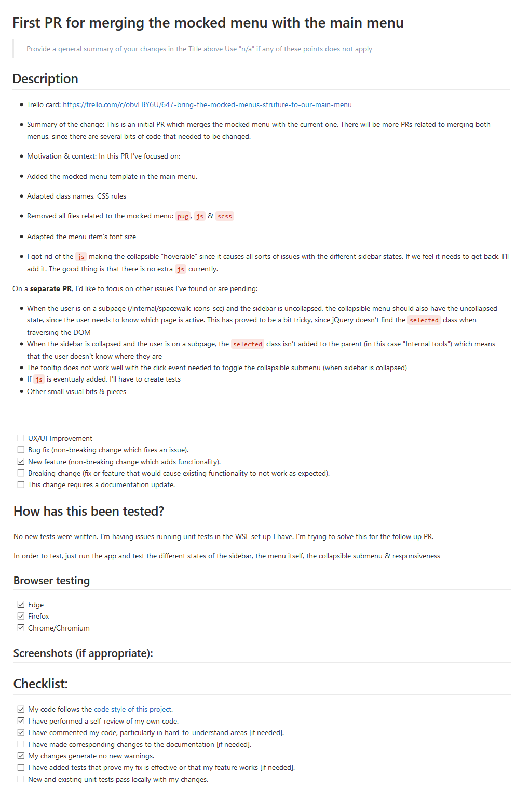

Writing good pull request descriptions is a great way to help reviewers know what to expect when reviewing code. They're also a great way to help track things that should be done for every change, such as testing, adding unit tests, and updating documentation.

Although using a template for a PR may sometimes feel a bit repetitive, it's a great way of helping your peers to focus on reviewing rather than having to focus in gathering information.

**The use of these PR templates is compulsory**.

We have created two types of templates: 
*  **Small fixes:** Use this template for small text changes, image updates or similar. Even though it doesn't require much information, please be thorough when filling it up.
*  **Extended:** This template should be used for any change in the code, new features, etc. Here is an example of how it should be filled:
