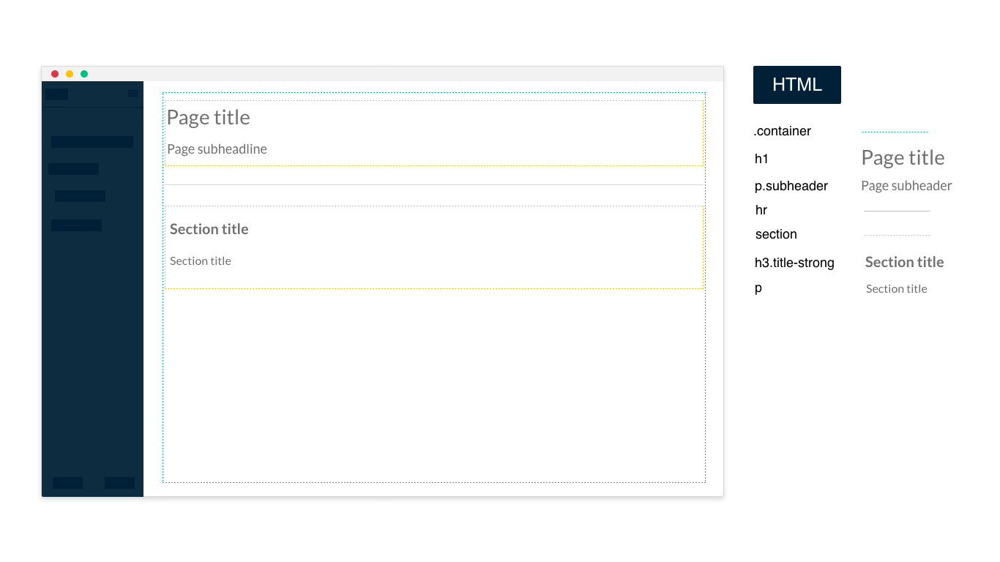

Our sections are creating with a main `.container` and `section` for each section of the page. The first page section should contain the page title and page subheadline. You can find a more graphic representation in the image below:


----

### PUG default structure

```pug
.container
  section
    h1
      | Page title
    p.subheadline
      | Page subheadline
  hr
  section
    h3.title-strong
      | section title
    p
      | section description
```