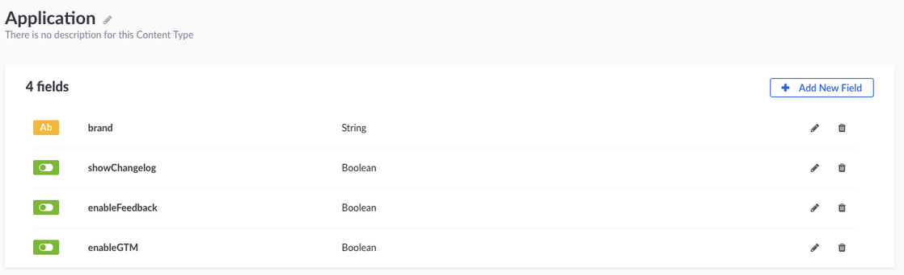
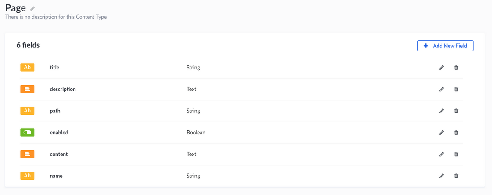

# EOS: Strapi integration

## Getting started
EOS depends on [Strapi](https://strapi.io/) for the configuration of the project and as a content management system. We use GraphQL with Strapi to query our data. You can find more at the [Strapi documentation](https://strapi.io/documentation/3.x.x/getting-started/quick-start.html#_5-consume-the-api) and [GraphQL Documentation](https://graphql.org/learn/)

After cloning EOS, make sure you set up and run a Strapi instance which will be used for content and storage of project data. 

We recommend using Heroku for the Strapi instance and MongoDB as database (you can get a free DB at [mlab](https://mlab.com/) by creating an account, or use the mlab plugin in Heroku).

⚠️ **Please note**: If you're using Heroku for you Strapi, the server is read-only (you cannot write any files) so generating models with Strapi is not possible. Make sure to do it locally then deploy back to Heroku.

## Configuring Strapi with Mongodb / Mlab
### Setting Strapi locally

1. Clone our Strapi repository https://gitlab.com/SUSE-UIUX/eos-strapi 
2. Create a local MongoDB database: https://docs.mongodb.com/manual/tutorial/install-mongodb-on-os-x/
   * Or create it in the cloud with https://cloud.mongodb.com or https://mlab.com/. You’ll require a connection URI and the name of the DB to set up the connection with Strapi.
   * More info about MongoDB URI format https://docs.mongodb.com/manual/reference/connection-string/
3. You'll need to set up two local variables in order for Strapi to connect to your database. (see Development and Production variables names below)
4. You can start Strapi by running npm start.

⚠️ **NOTE**: you can run Strapi in development or production by changing `NODE_ENV`.
eg: `env NODE_ENV= production npm start`

### Development
```
export EOS_DATABASE_DB_DEV= YOUR_MONGODB_DEVELOPMENT_DB_NAME
export EOS_DATABASE_URI_DEV= YOUR_MONGODB_DEVELOPMENT_DB_URI
```

### Production
```
export EOS_DATABASE_URI_PROD= YOUR_MONGODB_PRODUCTION_DB_URI
export EOS_DATABASE_DB_PROD= YOUR_MONGODB_PRODUCTION_DB_NAME
```

## Setting up EOS
Now the application, page models and their corresponding documents are set up*, we can start by setting the Strapi URL.

*⚠️ **NOTE**: For a route to render the correct title/description, the document path must match the route path. You can find our default structure here.

For this, you'll need to set some `env_variables` with your Strapi endpoint and auth.

⚠️ **NOTE**: Make sure you set the Authenticated role permission to be able to find and find one (Roles & Permissions > Authenticated)

### Development
```
export EOS_STRAPI_SERVER_DEV=YOUR_DEVELOPMENT_STRAPI_URL
export EOS_STRAPI_USERNAME_DEV=YOUR_DEVELOPMENT_STRAPI_USERNAME
export EOS_STRAPI_PASSWORD_DEV=YOUR_DEVELOPMENT_STRAPI_PASSWORD
```

Run EOS as development with:

`npm run env:dev`


### Production
```
export EOS_STRAPI_SERVER_PROD=YOUR_PRODUCTION_STRAPI_URL
export EOS_STRAPI_USERNAME_PROD=YOUR_PRODUCTION_STRAPI_USERNAME
export EOS_STRAPI_PASSWORD_PROD=YOUR_PRODUCTION_STRAPI_PASSWORD
```

Run EOS as production with:

`npm run env:prod`


Both the application and pages are managed in our middleware inside `modules/config-middleware.js ` 

## Content types in Strapi
Read more about Content Types [here](https://strapi.io/documentation/3.x.x/guides/models.html).

### Application

Once you have Strapi ready, head to the “CONTENT TYPE > Applications” and click on the button “Add new application”. You should create only 1 application and fill out the fields with your Product’s information. This is the basic configuration to display your brand’s name and some other basic configurations.



### Pages
This is used to dynamically set titles, description or enable a page inside the project.

⚠️ **NOTE**: For a route to render the correct title/description, the document path must match the route path. You can find our default structure [here](https://gitlab.com/SUSE-UIUX/eos/snippets/1928439).



### Backup your database
For our backup solutions, we're using MongoDB Community Edition to dump the data and Cloudinary as storage.  
To backup your mlab instance we're using the `api/mongodb` endpoint (see code in `routes/api/mongodb/index.js`).

You'll need to setup your Cloudinary API credentials env variables as follow: 
```js
// routes/api/mongodb/index.js, line 15
cloudinary.config({
  cloud_name: process.env.EOS_CDN_NAME,
  api_key: process.env.EOS_CDN_API_KEY,
  api_secret: process.env.EOS_CDN_API_SEC
})
```
And also your database URI variable:
```js
// routes/api/mongodb/index.js, line 23
exec(`mongodump --uri ${process.env.EOS_DATABASE_URI_PROD} -o ./backup/dump`, async () => { 
 // ...
}
```

Once you define your variable, you can send a post request to http://localhost:3000/api/mongodb that will:
1.  Generate a dump folder inside the `./backup` folder in the main directory.
2.  It will compress the folder into a `.zip` file
3.  It will upload the compressed file into your Cloudinary space, inside `./DB` folder.