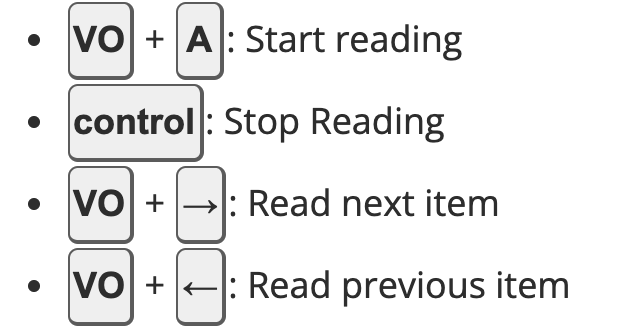

Screen readers can be challenging for first-time users. Understanding how to control it is essential to comprehend the user experience of visually impaired users and to be able to boost the accessibility of our UIs.

A comprehensive guideline for how to use VoiceOver is found at https://webaim.org/articles/voiceover/

For quick reference (and TL;DR), I'm adding a screenshot to the most important shortcuts:

- VO stands for VoiceOver and it references to the key combination: **control** + **option** on Mac

### Skipping parts of the application to read exactly what we need to test

Reading the entire site from top to bottom every time we need to test something can be time-consuming. A good practice is to directly position yourself in the element right before (above or on the right) the one you want to test. You can do so by double-clicking it with your mouse. Ideally, it should be a text so that no action is executed. Once you are there, the screen reader will read out loud the content you selected and stop. To proceed, you should let the SR automatically continue reading by pressing VO + A (option + control + A). VO+A will start the sequential reading from the position you are on.

If you need to test an element that alters the DOM after clicked, such as a dropdown, click on it to open up the new UI. Proceed with the same steps described above, always using VO+A so that you let the SR navigate you, as it would with a visually impaired user.